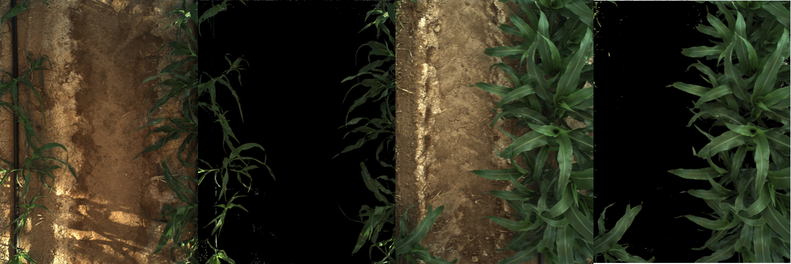
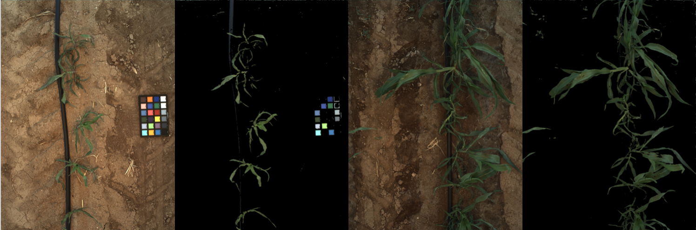
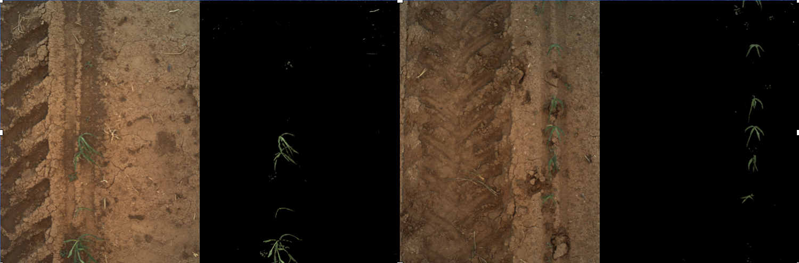
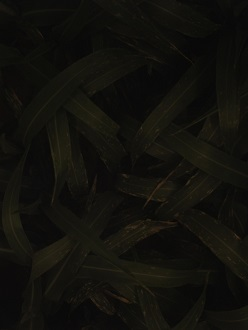
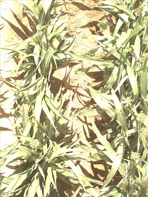
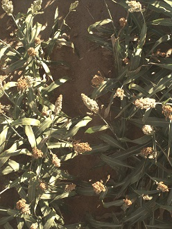

# Transformer Canopy Cover
Calculates canopy cover (the percentage pixels identified as a plant) on a plot level for one or more images

## Authors

* Zongyang Li, Donald Danforth Plant Science Center, St. Louis, MO
* Maxwell Burnette, National Supercomputing Applications, Urbana, Il
* Robert Pless, George Washington University, Washington, DC
* Chris Schnaufer, University of Arizona, Tucson, AZ

## Overview

This extractor processes binary stereo images and generates values of plot-level percent canopy cover traits that are inserted into the BETYdb trait database.

 The core idea for this extractor is a plant-soil segmentation. 
 We apply a threshold to differentiate plant and soil, and do a smoothing after binary processing. 
 From this difference, it returns a plant area ratio within the bounding box.

_Input_

  - Evaluation is triggered whenever a file is added to a dataset
  - Following data must be found
    - _left.bin image
    - _right.bin image
    - dataset metadata for the left+right capture dataset; can be attached as Clowder metadata or included as a metadata.json file
    
_Output_

  - The configured BETYdb instance will have canopy coverage traits inserted

## Algorithm description

The core idea for this extractor is a plant-soil segmentation. We apply a threshold to differentiate plant and soil, and do a smoothing after binary processing. At last it returns a plant area ratio within the bounding box.

Steps:

1. Split image data into R,G,B channel, and make a tmp image.

2. For each pixel, if G value is T(threshold) higher than R value, make this pixel as foreground, and set the tmp pixel value to 255, so all tmp pixels are 0 or 255.

3. Use a filter to blur this tmp image,

4. Threshold the blurred tmp image with a threshold of 128 to get a new mask image that represents our plant (foreground) detections.

5. Output ratio = foreground pixel count / total pixel count

### Parameters

* G - R Threshold is set to 2 for normal situation.
* Blur image to new mask threshold is set to 128

### Quality Statement

Currently, this algorithm has been used on wheat and sorghum; it has been tested on lettuce but only works when the leaves are green (fails if they are red or purple).

We believe the tested threshold works well in a normal illumination. Below are three examples of successful segmentation:






At the same time, there are some limitations with the current threshold. Here are some examples:

1. Image captured in a low illumination.



2. Image captured in a very high illumination.



3. In late season, panicle is covering a lot in the image, and leaves is getting yellow.



4. Sometimes an unidentified sensor problem results in a blank image.


For more details, see related discussions, including: https://github.com/terraref/reference-data/issues/186#issuecomment-333631648


## Use 

### Sample Docker Command line
Below is a sample command line that shows how the canopy cover Docker image could be run.
An explanation of the command line options used follows.
Be sure to read up on the [docker run](https://docs.docker.com/engine/reference/run/) command line for more information.

```docker run --rm --mount "src=/home/test,target=/mnt,type=bind" -e "BETYDB_URL=https://terraref.ncsa.illinois.edu/bety/" -e "BETYDB_KEY=<key value>" agpipeline/canopycover:3.0 --working_space "/mnt" --metadata "/mnt/08f445ef-b8f9-421a-acf1-8b8c206c1bb8_metadata.json" --citation_author "Me Myself" --citation_title "Something in the green" --citation_year "2019" --germplasm_name "Big Plant" "/mnt/rgb_mask_L2_my-site_2018-10-01__14-20-40_mask.tif"```

This example command line assumes the source files are located in the `/home/test` folder of the local machine.
The name of the image to run is `agpipeline/canopycover:3.0`.

We are using the same folder for the source metadata and the cleaned metadata.
By using multiple `--mount` options, the source and output files can be separated.

**Docker commands** \
Everything between 'docker' and the name of the image are docker commands.

- `run` indicates we want to run an image
- `--rm` automatically delete the image instance after it's run
- `--mount "src=/home/test,target=/mnt,type=bind"` mounts the `/home/test` folder to the `/mnt` folder of the running image
- `-e "BETYDB_URL=https://terraref.ncsa.illinois.edu/bety/"` the URL to the BETYdb instance to fetch plot boundaries, and other data, from
- `-e "BETYDB_KEY=<key value>"` the key associated with the BETYdb URL (replace `<key value>` with value of your key)

We mount the `/home/test` folder to the running image to make available the file to the software in the image.

**Image's commands** \
The command line parameters after the image name are passed to the software inside the image.
Note that the paths provided are relative to the running image (see the --mount option specified above).

- `--working_space "/mnt"` specifies the folder to use as a workspace
- `--metadata "/mnt/08f445ef-b8f9-421a-acf1-8b8c206c1bb8_metadata.json"` is the name of the source metadata to be cleaned
- `--citation_author "<author name>"` the name of the author to cite in the resulting CSV file(s)
- `--citation_title "<title>"` the title of the citation to store in the resulting CSV file(s)
- `--citation_year "<year>"` the year of the citation to store in the resulting CSV file(s)
- `"/mnt/rgb_mask_L2_my-site_2018-10-01__14-20-40_mask.tif"` the names of one or more image files to use when calculating plot-level canopy cover
